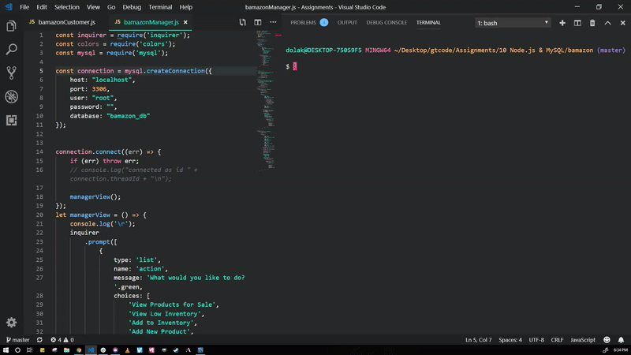

# bamazon

This app is an Amazon-like storefront with MySQL that will take in orders from customers and allow the manager to keep track of the store's inventory or replenish stock.

## npm packages:
  * `mysql`: https://www.npmjs.com/package/mysql
    * This is a node.js driver for mysql. It is written in JavaScript.
  * `inquirer`: https://www.npmjs.com/package/inquirer
    * A collection of common interactive command line user interfaces.
  * `colors`: https://www.npmjs.com/package/colors
    * Ability to get color and style in your node.js console.

## See how it works:
